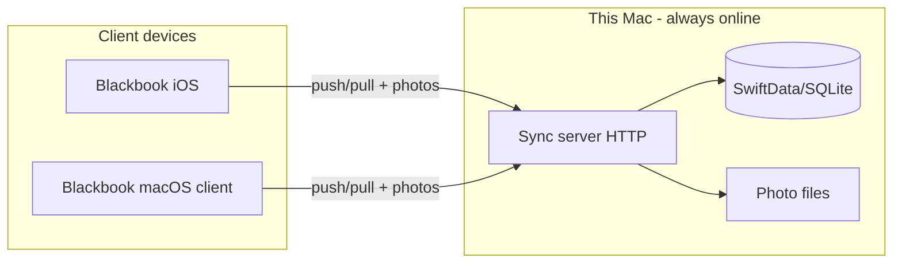

# Re-architecture: Multi-Device Sync via This Mac as Local Server

This document describes re-architecting Blackbook so that **all data is stored locally on one Mac**, which stays online and acts as the sync server. Other devices (iPhones, iPads, other Macs) sync with that Mac instead of AWS.

## Current vs Target

| Aspect | Current | Target |
|--------|--------|--------|
| **Source of truth** | AWS (AppSync + Cognito + S3) | This Mac (local SwiftData/SQLite + local photo directory) |
| **Sync** | Each device ↔ AWS (AWSSyncService, Amplify) | Each device ↔ Mac (new sync server + client) |
| **Auth** | Cognito (email/password, Sign in with Apple) | Optional: single “sync server password” to connect to the Mac; no cloud login in “local Mac” mode |
| **Photos** | S3 (PhotoStorageService) | Mac filesystem; served by sync server to clients |
| **Discovery** | N/A | Bonjour on LAN; optional manual URL (e.g. Tailscale) for remote |

## High-Level Architecture

- **This Mac** runs a small sync server (HTTP/HTTPS) that:
  - Uses the same data store as the Mac app (SwiftData-backed SQLite) as the single source of truth.
  - Stores contact photos in a local directory (e.g. `Application Support/Blackbook/Photos`).
  - Exposes a sync API (push/pull) and photo upload/download.
  - Optionally advertises itself via Bonjour so clients can discover it on the LAN.
  - Requires a shared secret (sync password) for client connections.
- **Other devices** run the existing Blackbook app in “client” mode:
  - They use a **LocalServerSyncService** (or similar) that talks to the Mac’s sync server instead of AWS.
  - Photos are requested from the Mac server instead of S3.
  - No Cognito; access is “connect to Mac” with server URL + password (or Bonjour-discovered URL + password).

## Components to Add or Change

### 1. Mac Sync Server (new)

- **Where:** New module or target in the Mac app (or a small separate process launched by the Mac app).
- **Responsibilities:**
  - Bind to a configurable port (e.g. 8765); optionally TLS (e.g. self-signed or user-supplied cert).
  - **Auth:** Validate a shared secret (sync password) on each request or once per session (e.g. header or query param for simple REST).
  - **Sync API** (REST or minimal custom protocol):
    - `GET /sync/changes?since=<iso8601>` — return contacts (and later other models) updated after `since`.
    - `POST /sync/changes` — body: list of contact changes (create/update/delete); server applies to its store (last-writer-wins by `updatedAt`).
  - **Photos:**
    - `GET /photo/<contactId>` — return photo bytes (or 404).
    - `POST /photo/<contactId>` — upload photo; store under `Application Support/Blackbook/Photos/<id>.jpg`.
  - **Discovery:** Register a Bonjour service (e.g. `_blackbook-sync._tcp`) with the Mac’s hostname and port so clients can discover the server on the same network.
- **Data:** Read/write the same SwiftData `ModelContext` / store the Mac app uses (or a dedicated SQLite DB with the same schema if the server runs in a separate process). Photos on disk as above.

### 2. Sync Protocol (design)

- **Pull:** Client sends `GET /sync/changes?since=<lastSyncTimestamp>`. Server returns JSON array of contact (and later other entity) payloads. Client applies them to local SwiftData (same semantics as current `applyRemoteContact`).
- **Push:** Client collects pending changes (same as current `fetchPendingContacts`), sends `POST /sync/changes` with JSON body. Server applies to its store (last-writer-wins), returns success/failure. Client marks items as synced.
- Reuse existing sync fields: `syncStatus`, `lastSyncedAt`, `syncVersion`, and `updatedAt` for conflict resolution. No change to SwiftData model schema required for the first iteration; only the transport switches from AppSync to the Mac server.

### 3. Client: Local Server Sync Service (new)

- **New type:** e.g. `LocalServerSyncService` (or a protocol `SyncService` with `AWSSyncService` and `LocalServerSyncService` implementations).
- **Configuration:** Server base URL (from Bonjour discovery or user-entered), sync password. Store in UserDefaults/Keychain (e.g. URL in UserDefaults, password in Keychain).
- **Behavior:** Same as `AWSSyncService` from the UI’s perspective: `configure(with: ModelContext)`, `performFullSync()` (push then pull), `isSyncing`, `lastSyncDate`, `syncError`, `pendingChangesCount`. Internally uses `URLSession` to call the Mac server’s sync and photo endpoints.
- **When to use:** App can run in one of two modes (or more later):
  - **Cloud mode:** Use existing `AWSSyncService` + Cognito + S3 (current behavior).
  - **Local Mac mode:** Use `LocalServerSyncService` + Mac server; no Cognito; optional “Sync server” settings (URL, password, discover via Bonjour).

### 4. Auth and Entry Flow

- **Cloud mode (unchanged):** `AuthGateView` → Cognito sign-in → main app with `AWSSyncService`.
- **Local Mac mode:** Either:
  - **Option A:** No gate; app opens to main app, and “Sync” in Settings is “Connect to Mac” (URL + password). If not yet connected, show a small banner or Settings section to set server URL and password; sync only runs when configured.
  - **Option B:** First launch in local mode shows a simple “Connect to your Mac” screen (server URL + password); then main app with `LocalServerSyncService`.

Recommendation: **Option A** (no separate gate; configure in Settings) to minimize flow changes and allow “use locally without any Mac” for testing.

### 5. Photos on Clients

- **New or refactored:** e.g. `PhotoStorageService` could depend on a “photo provider” protocol: cloud (S3) vs local server (Mac).
- **Local server provider:** Upload via `POST /photo/<contactId>` to Mac; download via `GET /photo/<contactId>`; cache locally same as today. Photo keys can stay as `contact-photos/<uuid>.jpg` in API; Mac server stores files under its own directory.

### 6. Discovery (Bonjour)

- **Server (Mac):** After binding, register `NSNetService` (or Swift equivalent) for `_blackbook-sync._tcp` with port and optional TXT record (e.g. app name).
- **Client (iOS/macOS):** Browse for `_blackbook-sync._tcp`; present list of discovered Macs; user picks one and optionally enters password (saved to Keychain). Fallback: “Enter URL manually” for remote access (e.g. `https://mac-tailscale-name:8765`).

### 7. What Stays / What’s Optional

- **Keep:** SwiftData models, existing UI, ContactSyncService (iOS Contacts import), scoring, reminders, AI (Claude), Google Calendar, subscriptions (StoreKit). No change to core app logic beyond “where does sync and photo storage go?”
- **Optional / phased:**
  - **Phase 1:** Contact sync + photos only (current scope of AWSSyncService and PhotoStorageService).
  - **Phase 2:** Extend sync protocol and server to other models (Interaction, Note, Tag, Group, Location, Activity, Reminder, ContactRelationship, RejectedCalendarEvent) so “everything” is stored on the Mac.
- **Remove or conditionally compile:** In local Mac mode, do not configure Amplify (Cognito, AppSync, S3). Either remove Amplify from the target when in “local only” or gate `configureAmplify()` and use of `AWSSyncService` / S3 behind a “sync mode” flag (e.g. from UserDefaults or build setting).

## Implementation Order (suggested)

1. **Sync server (Mac):** Implement HTTP server (e.g. Vapor, Hummingbird, or URLSession-based listener) with auth, `GET/POST /sync/changes`, and `GET/POST /photo/<id>`. Use existing SwiftData store and a dedicated photo directory. Add Bonjour registration.
2. **Sync protocol:** Define JSON shape for “list of contact changes” for push and pull so server and client agree (reuse current `contactToDict` / `applyRemoteContact` shapes).
3. **LocalServerSyncService:** Implement on client; same interface as `AWSSyncService`; call Mac server endpoints; handle offline queue similarly (retry when network restored).
4. **Settings / mode selection:** Add “Sync mode” (Cloud vs Local Mac). When Local Mac: show “Sync server” (discover + manual URL) and “Sync password”; persist and use for `LocalServerSyncService`.
5. **ContentView / app entry:** In local mode, inject `LocalServerSyncService` instead of `AWSSyncService`; skip Amplify config when in local mode.
6. **PhotoStorageService:** Abstract behind a protocol or inject “photo backend”; implement “local server” backend that uses Mac server’s photo endpoints.
7. **AuthGateView:** In local mode, skip Cognito gate (or show a minimal “Connected to Mac” state). Optionally keep Cloud mode behind existing AuthGateView.
8. **Phase 2 (later):** Extend server and client sync to all models; add migration path if existing users have cloud data.

## Network Notes

- **Same LAN:** Bonjour + local IP (e.g. `http://macbook.local:8765`) is enough.
- **Remote (Mac always online, user away):** Use Tailscale, Cloudflare Tunnel, or port forwarding so the Mac’s sync port is reachable at a stable URL; client uses “Enter URL manually” with that URL and the same sync password.

## Security

- Sync password: store only in Keychain; send over HTTPS in production (server TLS). For same-LAN only, HTTP might be acceptable if you document the risk.
- Server should validate the shared secret on every request (or use a short-lived token after initial auth) to avoid replay.

---

**Summary:** Add a sync server on the Mac (HTTP API + Bonjour), a client-side `LocalServerSyncService` and optional “Sync with Mac” settings, and a photo backend that uses the Mac’s photo directory. Keep Cloud mode as an option; in Local Mac mode, everything is stored on this Mac and other devices sync with it.
